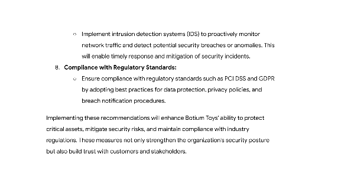

# 🔐 Gabriel Pereira – Cybersecurity Portfolio

Bem-vindo ao meu portfólio de projetos em segurança cibernética! Aqui você encontrará análises técnicas, checklists de conformidade, auditorias e atividades práticas que desenvolvi durante meus estudos e experiências profissionais.

---

## 🧠 Sobre mim

Sou QA Engineer em transição para cibersegurança, com foco em Blue Team. Tenho experiência em análise de tráfego de rede, testes manuais e automação, e estou me especializando em defesa, auditoria e compliance.

- 🎯 Foco: SOC, GRC, análise de riscos e segurança ofensiva defensiva
- 💬 Idiomas: Português (nativo), Inglês (avançado), Espanhol (intermediário)
- 📜 Certificações: CTFL (em andamento), Google Cybersecurity (Coursera)

---

## 🧪 Projetos

### 📡 **Análise DNS e ICMP com tcpdump**
- Análise de pacotes via `tcpdump` para investigação de erro "udp port 53 unreachable"
- Relatório de incidente com identificação do protocolo, porta afetada e resposta ICMP
- 🔗 [Ver no GitHub](https://github.com/gmap888/-cybersecurity-incident-dns-icmp/tree/main)

---

### 🛡️ **Auditoria de Segurança: Botium Toys**
- Checklist completo de controles administrativos, técnicos e físicos
- Avaliação de conformidade com PCI DSS e GDPR
- Recomendação de melhorias baseadas no NIST Cybersecurity Framework
- 🔗 [Ver no GitHub](https://github.com/gmap888/securityauditproject/tree/main)

---

## 📷 Imagens dos Relatórios

---

## 📫 Contato

- LinkedIn: [[linkedin.com/in/seuperfil](https://www.linkedin.com/in/seuperfil)](https://www.linkedin.com/in/gmapwebdev/)}
- GitHub: [github.com/seu-usuario](https://github.com/gmap888)
- Email: Gmapwebdev@gmail.com
- TEL +55 34998354994
